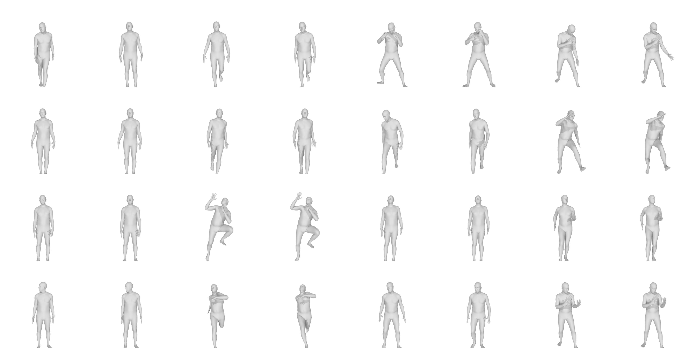

# Motion-Denoising
Denoising of 3D human motion animations by latent space projection.

## To-do :
- [X] Rendering utilities.
- [X] Data processing utilities.
- [X] Basic VAE model.
- [ ] Projection paths analysis.

## Current results
The following is the learning curve, the image to the right is the rendering of the ground truth while the left one is the reconstruction.

Learning curves (the total loss, reconstruction part and KL diverence part are all plotted).

