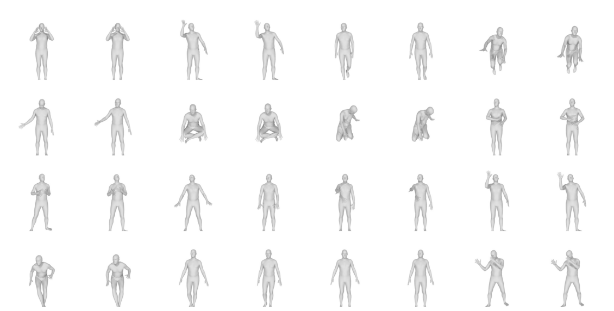
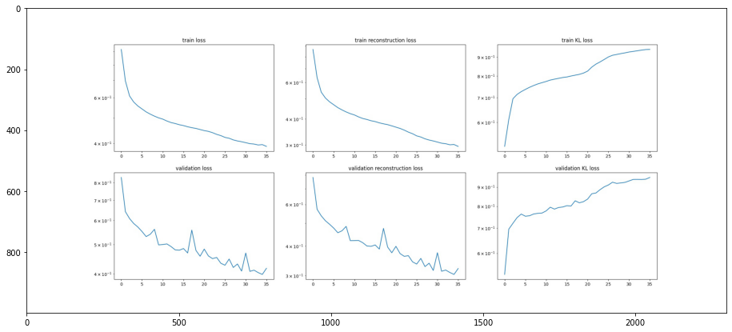
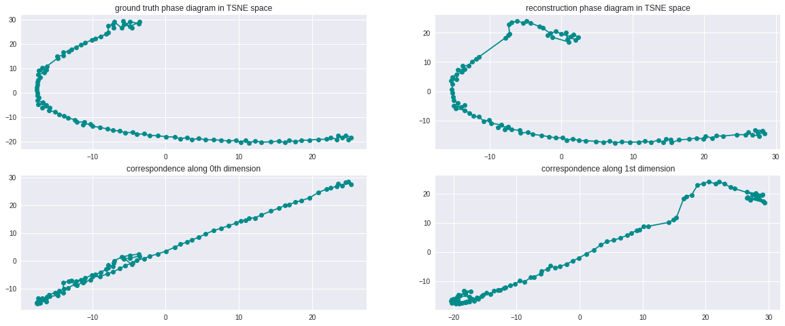
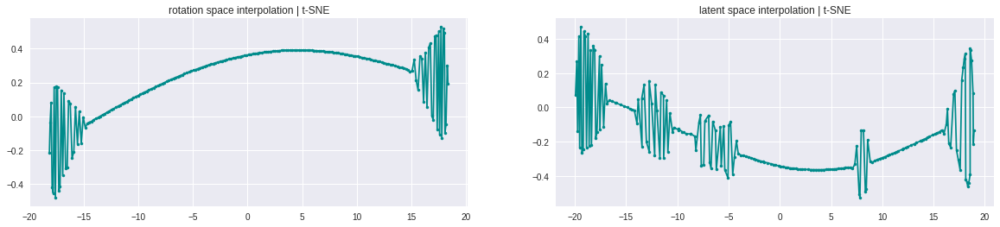
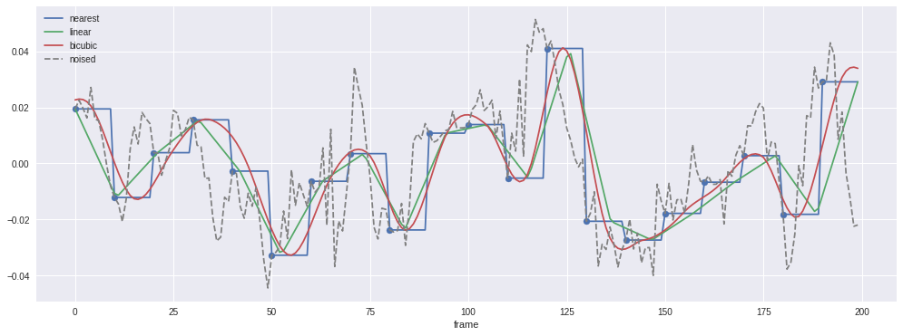

# Motion-Denoising
Denoising of 3D human motion animations by latent space projection.

## To-do :
- [X] Rendering utilities.
- [X] Data processing utilities.
- [X] Basic VAE model.
- [X] Projection paths analysis.
- [X] Denoising by gradient descent.
- [X] Denoising by Interpolation.
- [ ] Neural ODEs for denoising.

## Current results
The following is the learning curve, the image to the right is the rendering of the ground truth while the left one is the reconstruction.

Learning curves (the total loss, reconstruction part and KL diverence part are all plotted).

## Phase diagrams and correspondances in 2d t-SNE embedding space (example)

## Interpolation profil in 2D t-SNE space (example)

## Interpolation for denoising

