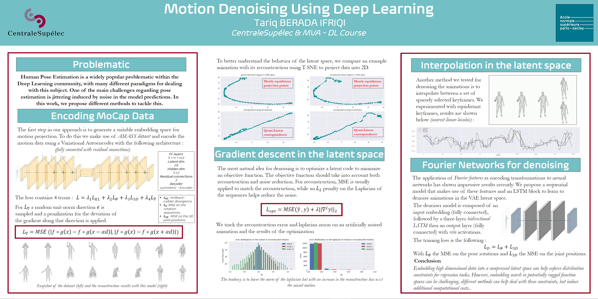

# Motion-Denoising
This is the code for the Motion Denoising project, for the course *Introduction to Deep Learning* for both CentraleSupélec & MVA. \
The notebook can be directly launched in colab and presents the results discussed in the article .

## To-do :
- [X] Rendering utilities.
- [X] Data processing utilities.
- [X] Basic VAE model.
- [X] Projection paths analysis.
- [X] Denoising by gradient descent.
- [X] Denoising by Interpolation.
- [X] Decoder block into denoising Autoencoder.
- [X] Gradient descent in sinusoidal basis. 
- [X] Denoiser model with sinsuoidal basis.

## Article
Link to the article 
## Notebook
Link to the notebook 
## Poster

(was not updated, content might differ from that of the article.)
